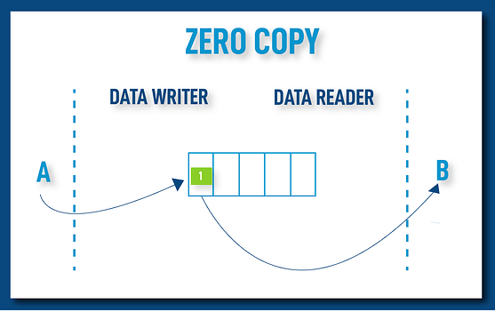

# Zero Copy Experiments

This repository contains experiments, configurations, and guides for optimizing ROS 2 performance using Fast DDS, specifically focusing on Zero Copy and monitoring.

## Contents

### [Loaned Messages (Zero Copy)](./loaned_messages/README.md)
Guide on configuring ROS 2 and Fast DDS to use Loaned Messages and Zero Copy Data Sharing. This mechanism minimizes data copying by allowing the middleware to manage memory, significantly improving performance for large data transfers.

### [Fast DDS Monitor](./fast_dds_monitor/README.md)
Setup guide for the Fast DDS Monitor tool. This includes instructions on building ROS 2 from source with `FASTDDS_STATISTICS=ON` to enable real-time monitoring of the DDS environment.

## Concepts

### Shared Memory Transport

.png)

The Shared Memory Transport works in order to deliver the data messages to the appropriate Domain Participants.

### Zero Copy Communication

This communication can be achieved between publishing and subscribing applications by taking advantage of the following three features:

*   **Data-sharing delivery**: As described above, it provides a copy-less communication channel between a DataWriter and a DataReader using shared memory.
*   **DataWriter sample loaning**: A Fast DDS extension which allows borrowing a sample buffer from the publishing DataWriter. Doing so, the application can write data in this buffer directly, thus eliminating the necessity of a copy between application and DataWriter.
*   **Loans from the DataReader**: The application gets the received samples as a reference to the receive queue itself. This prevents the copying of the data from the DataReader to the receiving application. Again, if Data-sharing delivery is used, the loaned data will be in the shared memory, and will indeed be the same memory buffer used in the DataWriter history.
